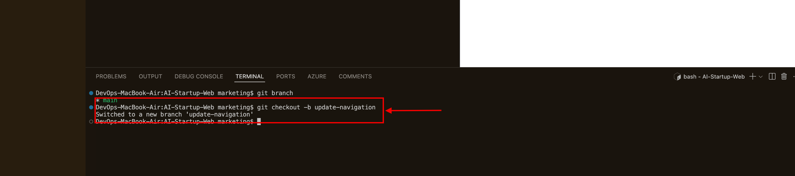

# AI-Startup-Web
Landing page

## Clone AI Startup Web from github

## Cloned directory on local

## Cd into new clone directory

## Using git commands to create and switch into a new branch 

## Same as above done for other branch

## Make changes
Using git status, git add, git commit -m

## Merged branches with main

git push setting upstream to insert new branches befofe merging

## ALl changes Merged

